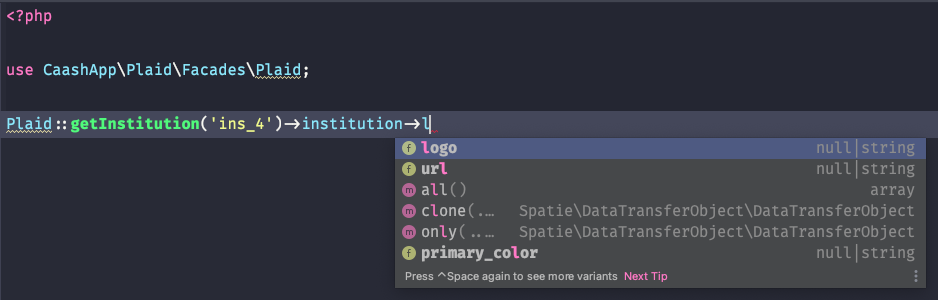

<br />

<div align="center">
  <a href="https://github.com/caashapp/plaid-sdk-laravel">
    
  </a>
</div>

<div align="center">
    <br />
    <a href="https://github.com/caashapp/plaid-sdk-laravel/issues/new?assignees=&labels=bug&template=01_BUG_REPORT.md&title=bug%3A+">Report a Bug</a>
    ·
    <a href="https://github.com/caashapp/plaid-sdk-laravel/issues/new?assignees=&labels=enhancement&template=02_FEATURE_REQUEST.md&title=feat%3A+">Request a Feature</a>
    ·
    <a href="https://github.com/caashapp/plaid-sdk-laravel/discussions">Ask a Question</a>
</div>

<br />

<div align="center">

[](LICENSE)
[](https://github.com/caashapp/plaid-sdk-laravel/issues?q=is%3Aissue+is%3Aopen+label%3A%22help+wanted%22)
[](https://github.com/caashapp)

</div>

<details open="open">
<summary>Table of Contents</summary>

- [Introduction](#introduction)
- [Installation & Setup](#installation--setup)
  - [Configuration](#configuration)
- [Usage](#usage)
  - [Structured Responses](#structured-responses)
  - [Sandbox Environment](#sandbox-environment)
- [Roadmap](#roadmap)
- [Support](#support)
- [Project assistance](#project-assistance)
- [Contributing](#contributing)
- [Authors & contributors](#authors--contributors)
- [Security](#security)
- [License](#license)

</details>

---

## Introduction

Plaid sdk for Laravel is built to make harnessing the power of Plaid into your Laravel 
application as simple as possible. The library maps the Plaid API into a series of methods
all bundled into a convenient Facade for rapid development and easy testing. Each method 
returns a structured object, so you don't need to go hunting through documentation, just let
code completion guide you through. 

#### Inspriation

Plaid sdk for Laravel is inspired by [TomorrowIdeas/plaid-sdk-php](https://github.com/TomorrowIdeas/plaid-sdk-php)
which I started using in a project, but found it wasn't well integrated with Laravel, and I 
thought I could do something better. If you just need a PHP implementation of the Plaid API, 
go check it out. 

## Installation & Setup

Require this package with composer. Laravel uses Package Auto-Discovery, so doesn't require you to manually add the ServiceProvider.

```shell
composer require caashapp/plaid-sdk-laravel
```

### Configuration

The defaults are set in `config/plaid.php`. Copy this file to your own config directory 
to modify the values. You can publish the config using this command:

```shell
php artisan vendor:publish --provider="CaashApp\Plaid\PlaidServiceProvider"
```

Before using Plaid sdk for Laravel, you will also need to add credentials for the 
Plaid service and set the environment. These credentials should be placed in your 
.env file, which will then be mapped into the `config\plaid.php` file. 

```dotenv
PLAID_ENV=sandbox
PLAID_CLIENT_ID=
PLAID_SECRET=
```

the `config/plaid.php` file also contains the configuration for the list of products
you want to use, the countries your app should pull institutions from and the 
default language. The default configuration should be good to go for testing in
the sandbox environment but be sure to review these settings, and the Plaid API 
documentation prior to moving your application to production. 

## Usage

You may interact with the Plaid AIP using the Plaid facade. 

```php
use CaashApp\Plaid\Facades\Plaid;

Plaid::createLinkToken(string $userId, array $options = [])
Plaid::updateLinkToken(string $userId, string $accessToken, array $options = [])
Plaid::exchangePublicToken(string $publicToken)
Plaid::getItem(string $accessToken)
Plaid::updateWebhook(string $accessToken, string $webhook)
Plaid::removeItem(string $accessToken)
Plaid::listInstitutions(int $count, int $offset, array $options = [])
Plaid::getInstitution(string $institutionId, array $options = [])
Plaid::searchInstitutions(string $query, array $options = [])
Plaid::getAccount(string $accessToken)
Plaid::rotateAccessToken(string $accessToken)
```

### Structured Responses

Each method returns a complex object, containing a fully typed and annotated structure. So if you
use an IDE that provides code completion, you'll spend a lot less time hunting through documentation
for the properties you want.



### Sandbox Environment

When in the sandbox environment, Plaid provides a few extra helper API which are also exposed via
the Plaid facade

```php
use CaashApp\Plaid\Facades\Plaid;

Plaid::createPublicToken(string $institutionId, array $options = null)
Plaid::resetItemLogin(string $accessToken)
Plaid::fireWebhook(string $accessToken, string $webhookCode = 'DEFAULT_UPDATE')
Plaid::createTestItem(string $institution)
```

## Roadmap

This library is not complete, many of Plaids products are not yet implemented. You can create links, 
get bank accounts, balances and transactions today. More will be added to the library and pushed out
as a complete product category at once. 

The priority for now is transactions and balances, including a full test suit. 

See the [open issues](https://github.com/caashapp/plaid-sdk-laravel/issues) for a list of proposed features (and known issues).

- [Top Feature Requests](https://github.com/caashapp/plaid-sdk-laravel/issues?q=label%3Aenhancement+is%3Aopen+sort%3Areactions-%2B1-desc) (Add your votes using the 👍 reaction)
- [Top Bugs](https://github.com/caashapp/plaid-sdk-laravel/issues?q=is%3Aissue+is%3Aopen+label%3Abug+sort%3Areactions-%2B1-desc) (Add your votes using the 👍 reaction)
- [Newest Bugs](https://github.com/caashapp/plaid-sdk-laravel/issues?q=is%3Aopen+is%3Aissue+label%3Abug)

## Support

Reach out to the maintainer at one of the following places:

- [GitHub Discussions](https://github.com/caashapp/plaid-sdk-laravel/discussions)
- Contact options listed on [this GitHub profile](https://github.com/indemnity83)

## Project assistance

If you want to say **thank you** or/and support active development of Plaid sdk for Laravel:

- Add a [GitHub Star](https://github.com/caashapp/plaid-sdk-laravel) to the project.
- Tweet about the Plaid sdk for Laravel.
- Write interesting articles about the project on [Dev.to](https://dev.to/), [Medium](https://medium.com/) or your personal blog.

Together, we can make Plaid sdk for Laravel **better**!

## Contributing

First off, thanks for taking the time to contribute! Contributions are what make the open-source community such an amazing place to learn, inspire, and create. Any contributions you make will benefit everybody else and are **greatly appreciated**.


Please read [our contribution guidelines](docs/CONTRIBUTING.md), and thank you for being involved!

## Authors & contributors

The original setup of this repository is by [Kyle Klaus](https://github.com/indemnity83).

For a full list of all authors and contributors, see [the contributors page](https://github.com/caashapp/plaid-sdk-laravel/contributors).

## Security

Plaid sdk for Laravel follows good practices of security, but 100% security cannot be assured.
Plaid sdk for Laravel is provided **"as is"** without any **warranty**. Use at your own risk.

_For more information and to report security issues, please refer to our [security documentation](docs/SECURITY.md)._

## License

This project is licensed under the **MIT license**.

See [LICENSE](LICENSE) for more information.
